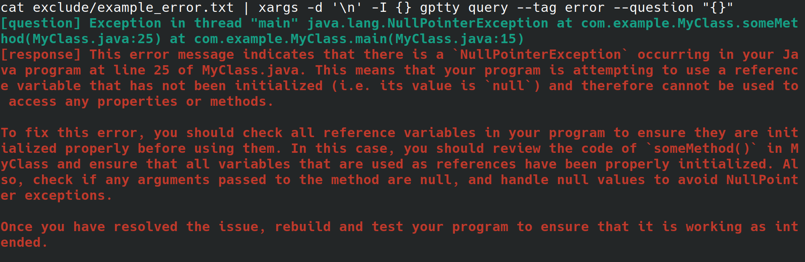
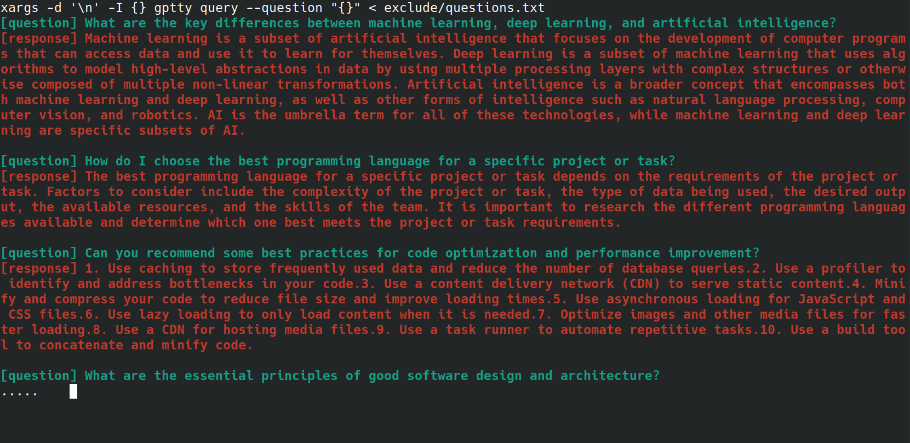

# gptty

[](https://github.com/signebedi/gptty/blob/master/LICENSE) 
[](https://pypi.python.org/pypi/gptty)
[](https://pepy.tech/project/your-package-name)

ChatGPT wrapper in your TTY

## About

gptty is a ChatGPT shell interface that allows you to (1) interact with ChatGPT in a manner similar to the web application, but without needing to rely on the web application's stability; (2) preserve context across chat sessions and structure your conversations however you want; (3) saves local copies of your conversations for easy reference.

#### Use Cases

Imagine, you are a system admininstrator configuring a web server for your employer. You're accessing the system from a physical interface, with internet connection but no desktop environment or graphical user interface. While configuring the web server, you receive an inexplicable error that you redirect to a file, but don't want to have to jump through hoops to copy it to another system with a browser so you can look up the error. Instead, you install gptty and redirect the error to the chat client with the command `cat app.error | xargs -d '\n' -I {} gptty query --tag error --question "{}"`.



#### Model Support

OpenAI makes a number of models available through their API. \[[1](https://platform.openai.com/docs/models/model-endpoint-compatibility)\] Currently, gptty supports `Completions` (davinci, curie) and `ChatCompletions` (gpt-3.5-turbo, gpt-4). All you need to do is specify the model name in your [config](#configuration) (default is text-davinci-003), and the application will handle the rest. 

## Installation

You can install `gptty` on pip:

```
pip install gptty
```

You can also install from git:

```
cd ~/Code # replace this with whatever directory you want to use
git clone https://github.com/signebedi/gptty.git
cd gptty/

# now install the requirements
python3 -m venv venv
source venv/bin/activate
pip install -r requirements.txt
pip install -e ./ # install the local package [optional but recommended to run as an executable]
```

Now, you can verify it is working by running `gptty --help`. If you experience an error, try [configuring](#configuration) the app.

## Configuration

`gptty` reads configuration settings from a file named `gptty.ini`, which the app expects to be located in the same directory that you are running `gptty` from unless you pass a custom `config_file`. The file uses the INI file format, which consists of sections, each with its own key-value pairs.

| Key    | Type | Default Value    | Description |
| -------- | ------- | -------- | ------- |
| api_key  | String    | ""  |   The API key for OpenAI's GPT service  |
| your_name    | String    | "question"    |   The name of the input prompt  |
| gpt_name  | String    | "response"  |   The name of the generated response  |
| output_file | String     | "output.txt" |    The name of the file where the output will be saved  |
| model    | String    | "text-davinci-003"    |   The name of the GPT model to use  |
| temperature  | Float    | 0.0  |   The temperature to use for sampling  |
| max_tokens | Integer     | 250 |    The maximum number of tokens to generate for the response  |
| max_context_length    | Integer    | 150    |   The maximum length of the input context  |
| context_keywords_only    | Bool    | True    |   Tokenize keywords to reduce API usage   |
| preserve_new_lines    | Bool    | False    |   Keep original formatting of response   |


You can modify the settings in the configuration file to suit your needs. If a key is not present in the configuration file, the default value will be used. The [main] section is used to specify the program's settings. 

```ini
[main]
api_key=my_api_key
```

This repository provides a sample configuration file `assets/gptty.ini.example` that you can use as a starting point. 

## Usage

#### Chat

The chat feature provides an interactive chat interface to communicate with ChatGPT. You can ask questions and receive responses in real-time.

To start the chat interface, run `gptty chat`. You can also specify a custom configuration file path by running: 

```
gptty chat --config_path /path/to/your/gptty.ini
``` 

Inside the chat interface, you can type your questions or commands directly. To view the list of available commands, type `:help`, which will show the following options.

| Metacommand    | Description    | 
| -------- | ------- | 
| :help | Display a list of available commands and their descriptions.   |
| :quit | Exit ChatGPT.   |
| :logs | Display the current configuration settings.   |
| :context[a:b] | Display the context history, optionally specifying a range a and b. *Under development*   |

To use a command, simply type it into the command prompt and press Enter. For example, use the following command to display the current configuration settings in the terminal:

```
> :configs

api_key: SOME_CONFIG_HERE
your_name: question
gpt_name: response
output_file: output.txt
model: text-davinci-003
temperature: 0.0
max_tokens: 250
max_context_length: 5000
```

You can type a question into the prompt anytime, and it will generate a response for you. If you'd like to share context across queries, see the [context](#context) section below.

#### Query

The query feature allows you to submit a single or multiple questions to ChatGPT and receive the answers directly in the command line.

To use the query feature, run something like:

```
gptty query --question "What is the capital of France?" --question "What is the largest mammal?"
```

You can also provide an optional tag to categorize your query: 

```
gptty query --question "What is the capital of France?" --tag "geography"
``` 

You can specify a custom configuration file path if needed: 
```
gptty query --config_path /path/to/your/gptty.ini --question "What is the capital of France?"
```

Remember that gptty uses a configuration file (by default gptty.ini) to store settings like API keys, model configurations, and output file paths. Make sure you have a valid configuration file before running gptty commands.

## Context

Tagging text for context when using the `chat` and `query` subcommands in this app can help improve the accuracy of the generated responses. Here's how the app handles context with the `chat` subcommand:

1. Identify the context of your question or statement. 
2. Assign a tag to that context. The tag can be a word or short phrase that describes the context like `bananas` or `shakespeare`.
3. Include the tag in your input message by prefixing it with `[tag]`. For example, if the context of your question is "cooking," you can tag it as `[cooking]`.
Make sure to use the same tag consistently for all related queries.
4. The application will save your tagged question and response in the output file specified in the code output file.
5. When asking subsequent questions on the same topic, provide the tag in your input message in order to retrieve the relevant context for the generated response.

Here is an example of what this might look like, using questions tagged as `[shakespeare]`. Notice how, in the second question, the name 'William Shakespeare' is not mentioned at all.


When you are using the `query` subcommand, follow the same steps described above but, instead of prepending the text of your questions with your desired tag, use the `--tag` option to include the tag when submitting your query. For example, if the context of your question is "cooking," you can use:

```
gptty --question "some question" --tag cooking
```

The application will save your tagged question and response in the output file specified in the config file.


## Scripting

You can automate the process of sending multiple questions to the `gptty query` command using a bash script. This can be particularly useful if you have a list of questions stored in a file, and you want to process them all at once. For example, let's say you have a file `questions.txt` with each question on a new line, like below.

```
What are the key differences between machine learning, deep learning, and artificial intelligence?
How do I choose the best programming language for a specific project or task?
Can you recommend some best practices for code optimization and performance improvement?
What are the essential principles of good software design and architecture?
How do I get started with natural language processing and text analysis in Python?
What are some popular Python libraries or frameworks for building web applications?
Can you suggest some resources to learn about data visualization and its implementation in Python?
What are some important concepts in cybersecurity, and how can I apply them to my projects?
How do I ensure that my machine learning models are fair, ethical, and unbiased?
Can you recommend strategies for staying up-to-date with the latest trends and advancements in technology and programming?
```

You can send each question from the `questions.txt` file to the `gptty query` command using the following bash one-liner:

```bash
xargs -d '\n' -I {} gptty query --question "{}" < questions.txt
```


